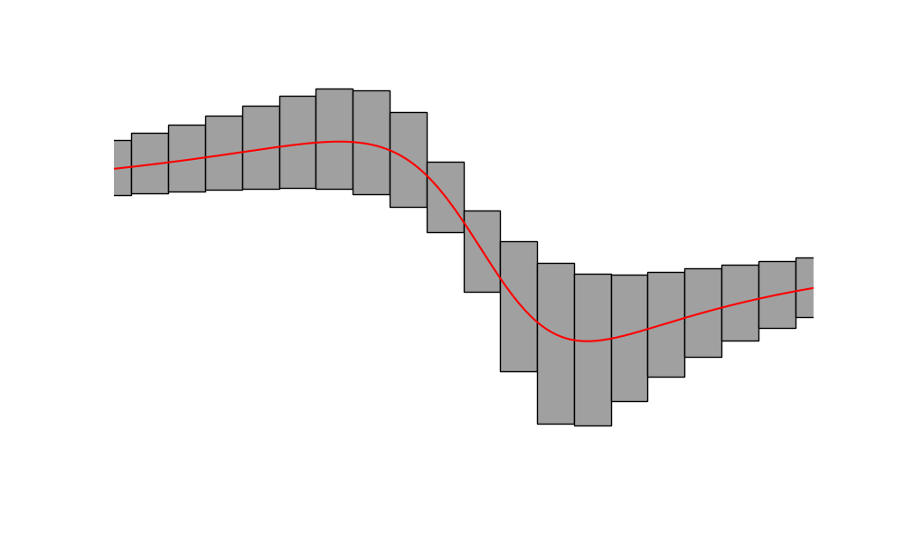
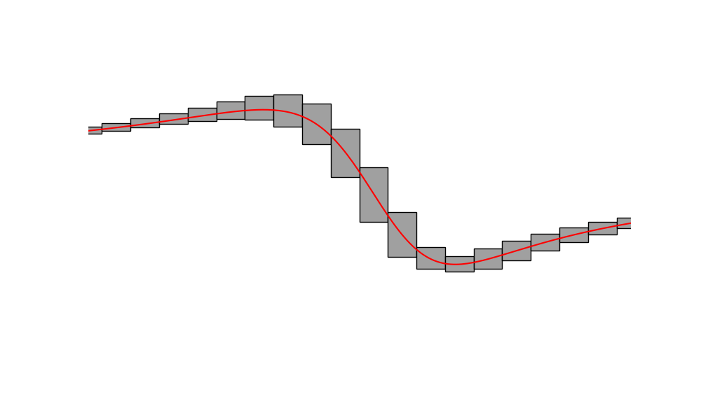
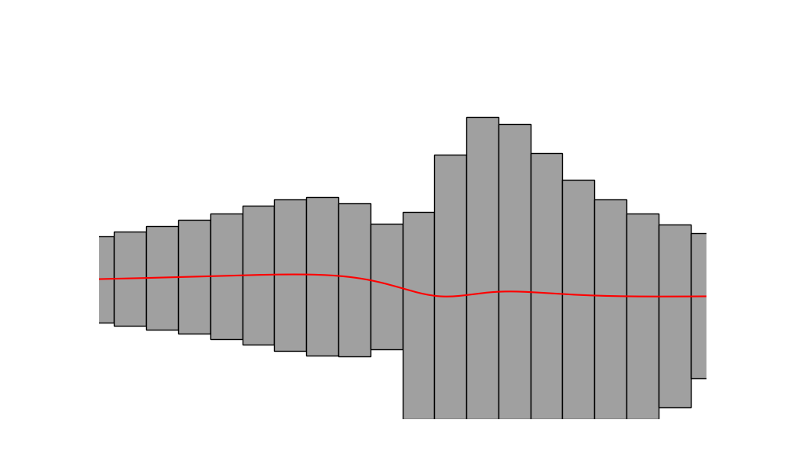
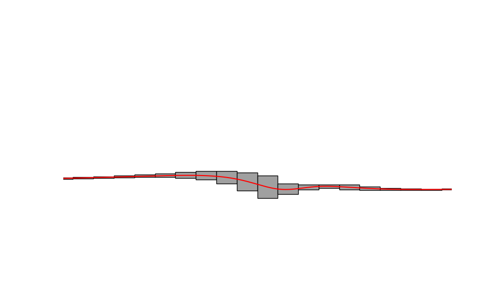

# About
**Hobby** implementation of [Affine arithmetic]() and [Interval arithmetic]().

| Interval  arithmetic           |  Affine arithmetic|
:-------------------------:|:-------------------------:
  |  
  |  

# Reference
[1] Rump, S. M., & Kashiwagi, M. (2015). Implementation and improvements of affine arithmetic. Nonlinear Theory and Its Applications, IEICE, 6(3), 341–359. https://doi.org/10.1587/nolta.6.341  
[2] Stolfi, J., & de Figueiredo, L. H. (2003). An Introduction to Affine Arithmetic. Trends in Computational and Applied Mathematics, 4(3), 297–312. https://doi.org/10.5540/tema.2003.04.03.0297  
[3] Comba, J. L. D., & Stolfi, J. (1993). Affine Arithmetic and its Applications to Computer Graphics.
